# Rackglow

**An audio-reactive lighting controller for a modular synth case.** A 3.5" touchscreen on the
front panel, WS2812 strips behind the rails, and a spectrum analyser listening to the case's
output — so the lights move with whatever you're patching. Control it from the screen, from a
browser, or from Home Assistant.

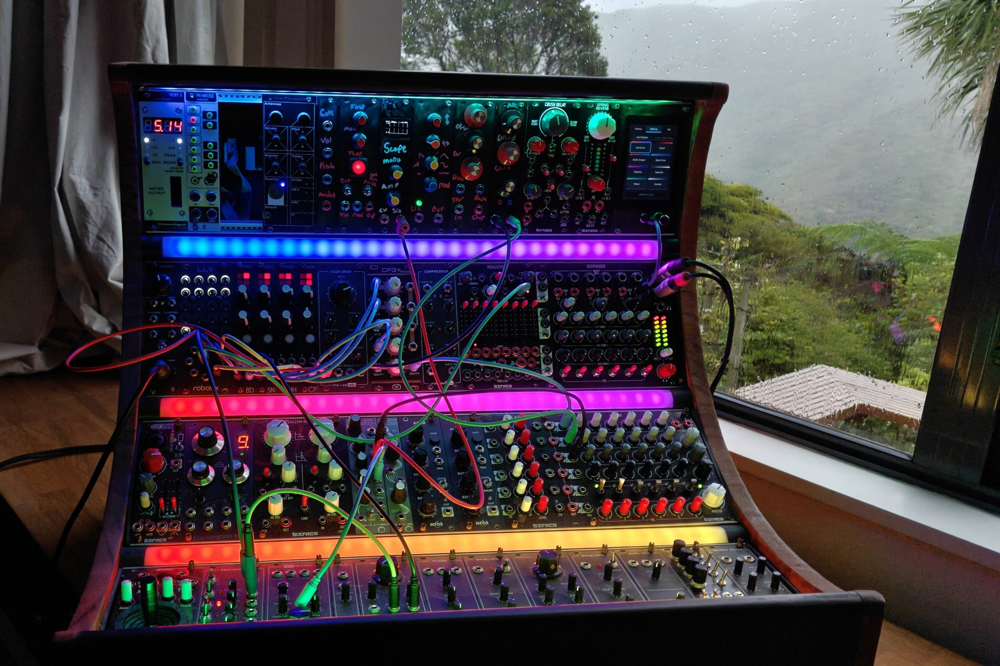

<!-- TODO: demo video. Drag the .mp4 into this file in GitHub's web editor so it uploads to
     user-attachments and renders as a player; a committed .mp4 renders as a plain link.
     Constraints, all verified: 10 MB ceiling on a FREE plan (100 MB only on paid); H.264, because
     GitHub's own docs say codec support is browser-specific and a phone's HEVC will not play for
     most viewers; and the poster frame CANNOT be chosen — GitHub builds its own player from the
     attachment URL and <video> is not in the markdown sanitiser's allowlist, so the thumbnail is
     the first frame. The hero image above this line is what covers that. -->

## Features

- **Colour, white and effects** — a colour wheel, a white mode, and 17 effects, 7 of them
  audio-reactive (marked **(A)**: Ice Waves, Purple Rain, Fire, Matrix, VU, Ripple, Confetti).
- **Audio-reactive** — an MSGEQ7 seven-band spectrum analyser drives the (A) effects and a VU mode
  that pumps the strip brightness with the level.
- **Touchscreen UI** — three swipeable tabs: Colour, Effects and a live VU meter.
- **Screensaver** — after an idle timeout the screen hands over to one of five full-screen
  visuals (VU Meter, Waterfall, Aurora, Bloom, Rings); swipe to change, tap to dismiss.
- **Web UI** — the same controls from any browser on your network, plus LED, screensaver and
  Home Assistant settings.
- **Home Assistant** — appears automatically over MQTT as a light (colour, brightness, effects) with
  VU Mode and Screen Sleep switches. No custom integration needed.
- **Screen Sleep** — turn the screen fully off from Home Assistant; tap it to wake.
- **Updates over WiFi** — WiFi setup, a log viewer and firmware updates come from
  [Preflight](https://github.com/diydoohickeys/Preflight-Arduino).

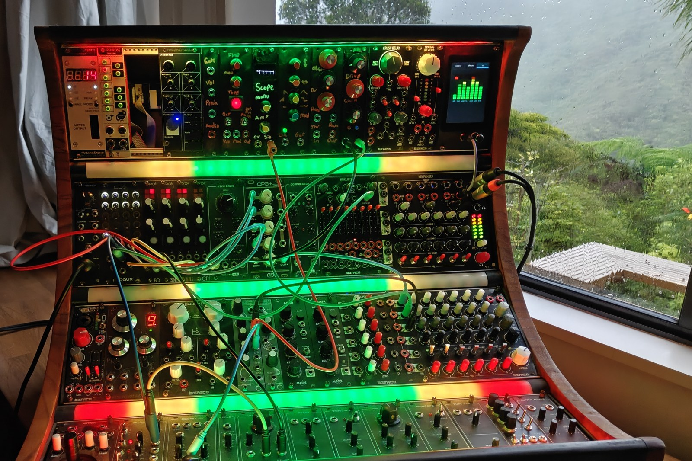

| Colour | Effects | VU |
|---|---|---|
| 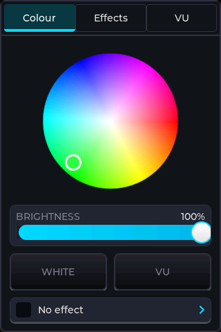 | 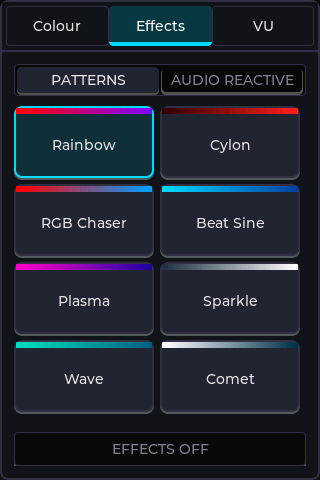 | 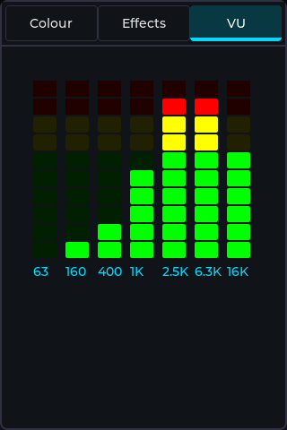 |

| VU Meter | Waterfall | Aurora | Bloom | Rings |
|---|---|---|---|---|
| 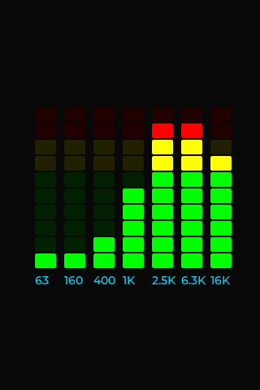 | 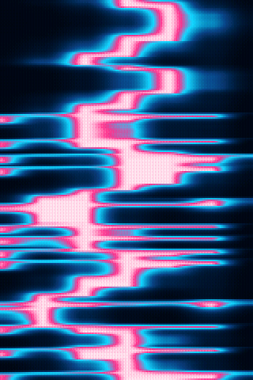 | 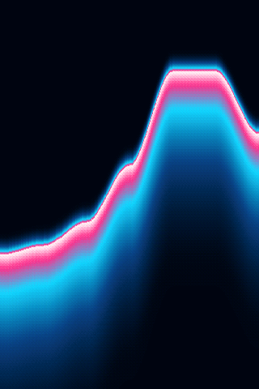 | 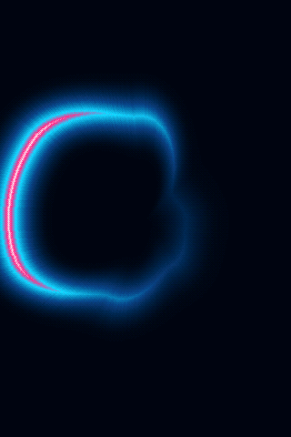 | 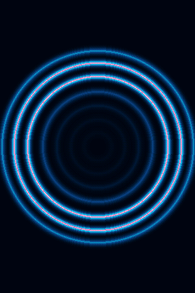 |

## Hardware

Everything sits behind a 3D-printed panel: the board, and a scrap of protoboard carrying an MSGEQ7
and a handful of passives. There's no custom PCB to order.

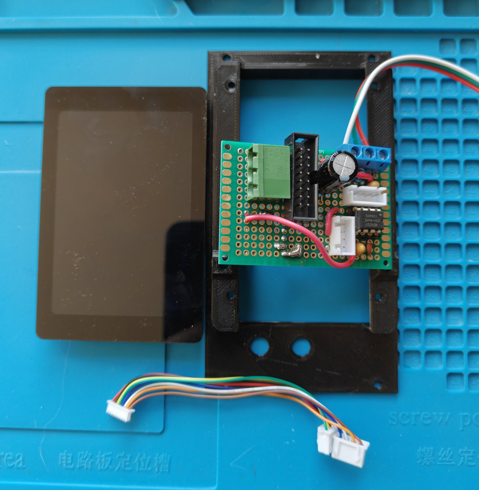

| Part | Qty | Notes |
|---|---|---|
| [WT32-SC01 Plus](https://en.wireless-tag.com/product-item-26.html) | 1 | ESP32-S3, 8 MB flash, QSPI PSRAM, 3.5" 320×480 ST7796 touchscreen |
| MSGEQ7 | 1 | Seven-band graphic equaliser, DIP-8. A socket is worth it |
| WS2812 / WS2812B strips | — | Equal-length strips on one data line. The builds here are 5 × 29 and 3 × 29 LEDs |
| A10k potentiometer | 1 | Front-panel input attenuator (audio taper) |
| 3.5 mm jack | 1 | Audio in |
| 22 kΩ, 330 Ω resistors | 1 each | Audio input; WS2812 data line |
| 200 kΩ resistor | 1 | MSGEQ7 clock |
| 0.01 µF, 33 pF, 2 × 0.1 µF | | MSGEQ7 input, clock and decoupling |
| 1000 µF electrolytic, 6.3 V+ | 1 | Across 5 V at the LED terminal |
| Screw terminals, 2- and 3-way | 1 each | 5 V input; LED output |
| 10-pin IDC header | 1 | Eurorack bus power (optional, see below) |
| Protoboard, hook-up wire, JST connectors | | |
| 5 V supply for the strips | 1 | Roughly 60 mA per LED at full white. Separate from the case's Eurorack supply |

### Wiring

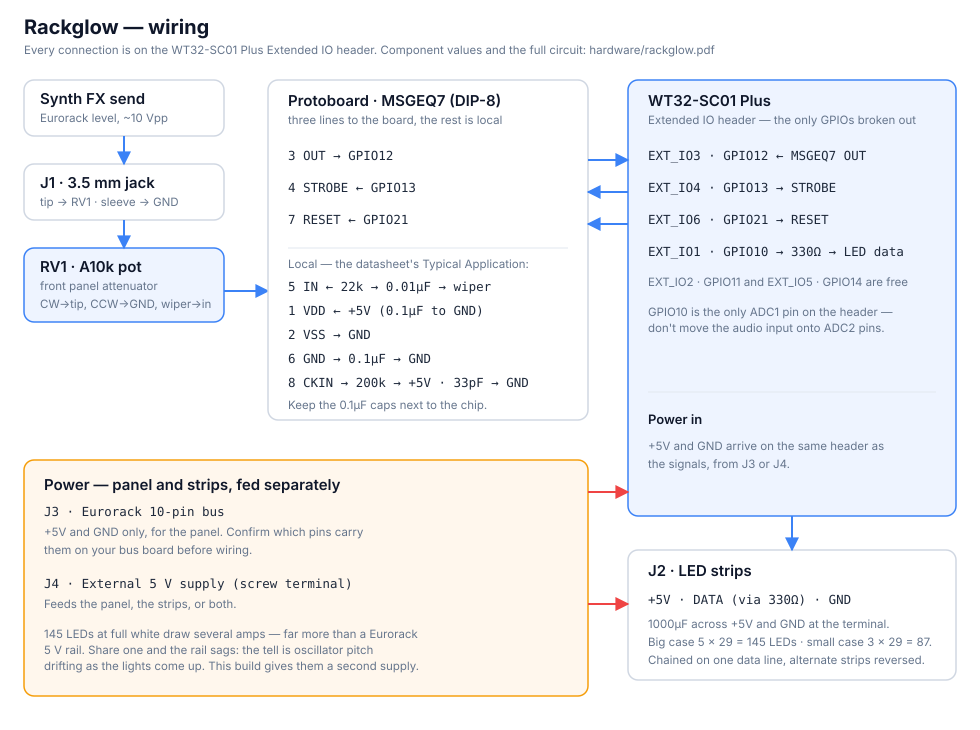

Everything connects to the board's **Extended IO header**, which also carries +5 V and GND. These
are the only GPIOs the WT32-SC01 Plus breaks out; the rest drive the display and touch.

| Header pin | GPIO | Connect to |
|---|---|---|
| EXT_IO1 | 10 | WS2812 data, through the 330 Ω resistor |
| EXT_IO3 | 12 | MSGEQ7 OUT (pin 3) |
| EXT_IO4 | 13 | MSGEQ7 STROBE (pin 4) |
| EXT_IO6 | 21 | MSGEQ7 RESET (pin 7) |
| EXT_IO2, EXT_IO5 | 11, 14 | free |

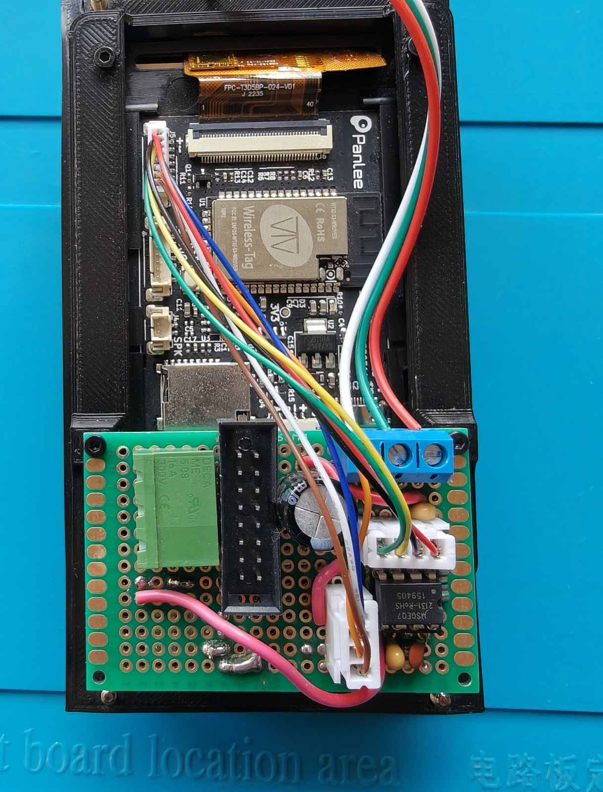

**The MSGEQ7 circuit is the datasheet's Typical Application**, unchanged: 22 kΩ and 0.01 µF into IN,
0.1 µF on VDD, another 0.1 µF on pin 6 (the chip's internal 2.5 V reference), and the clock set by
200 kΩ from CKIN up to VDD with 33 pF from CKIN down to ground. Full schematic:
[`hardware/rackglow.pdf`](hardware/rackglow.pdf), editable in KiCad as
[`hardware/rackglow.kicad_sch`](hardware/rackglow.kicad_sch).

**Audio in.** The jack takes a Eurorack-level signal — an FX send, in this build — which is around
10 Vpp, while the MSGEQ7 wants roughly 0.1–0.3 Vpp. The front-panel pot does that attenuation: turn
it up until the loudest passage just reaches the top band without pinning, then back off slightly.
Line level works too, with the pot further up.

**Power.** The panel and the strips are fed separately — the panel draws very little, the strips
draw a lot.

| | Feeds | Notes |
|---|---|---|
| J3 · Eurorack 10-pin bus header | the panel | +5 V and GND from the case's bus board |
| J4 · 5 V screw terminal | the panel, the strips, or both | An external supply |

⚠ **Don't run the strips from a Eurorack 5 V rail.** 145 LEDs at full white can ask for several amps,
far more than those rails are built for. Give the strips their own 5 V supply, sized for roughly
60 mA per LED at full white, and share ground with the board.

What that looks like if you get it wrong: **oscillator pitch drifting as you turn the lights up.**
The strips load the rail, the rail sags, and everything running off it goes with it. That symptom is
what put the second supply in this build — and it reads as a synth fault, not a lighting one.

The reference build uses **two supplies**: the case's Eurorack bus powers the panel through J3, and
a second 5 V supply drives the LED strips alone. One supply through J4 works too, if it is sized for
the strips plus the board.

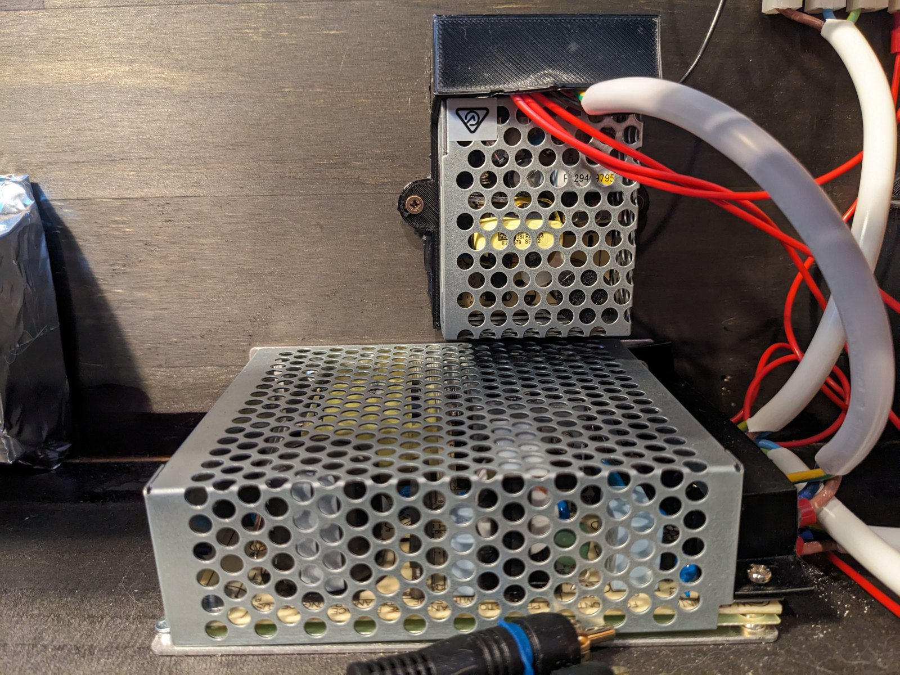

**Strip layout.** Strips are daisy-chained on the one data line and treated as equal-length rows.
Alternate strips run in opposite directions (serpentine), which is how they chain naturally behind a
rail. Set the strip count and LEDs per strip under **LED Config** in the web UI.

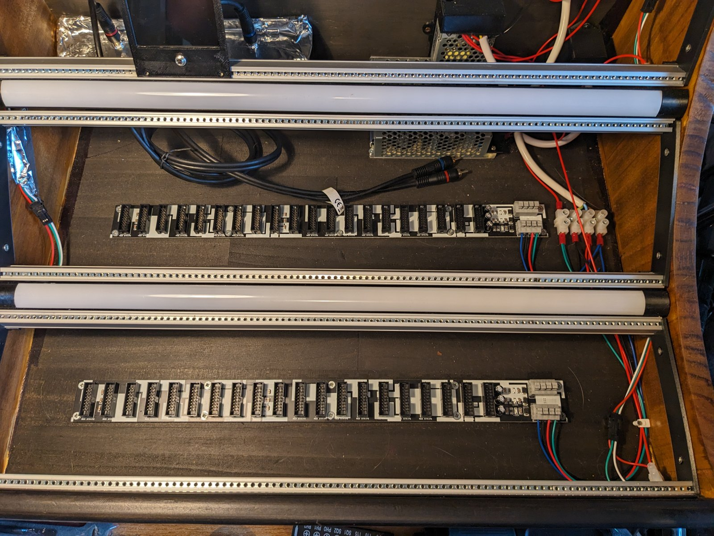

## Install

### From your browser (easiest)

1. Open **[diydoohickeys.github.io/Rackglow](https://diydoohickeys.github.io/Rackglow/)** in desktop
   Chrome or Edge. Firefox, Safari and phones don't support Web Serial.
2. Plug the board in over USB-C and click **Install**. No button to hold — the board is put into
   download mode over the USB connection.
3. The install erases the board, so it starts fresh.

### First-time setup

1. On first boot Rackglow opens a WiFi network called **`Rackglow-Setup`**
   (password `rackglow123`).
2. Join it from your phone. The setup page opens by itself; if it doesn't, browse to
   `192.168.4.1`.
3. Pick your WiFi network, enter its password and a device name, and save. Rackglow restarts and
   joins your network.
4. Open **`http://rackglow.local`** (or the IP address shown on the screen) and set the strip
   layout under **LED Config**.

### Updating

Download `firmware.bin` from the [latest release](https://github.com/diydoohickeys/Rackglow/releases/latest)
and upload it at **`http://rackglow.local/update`**. Settings are kept.

## Web UI

| Controls | Audio Reactive |
|---|---|
| 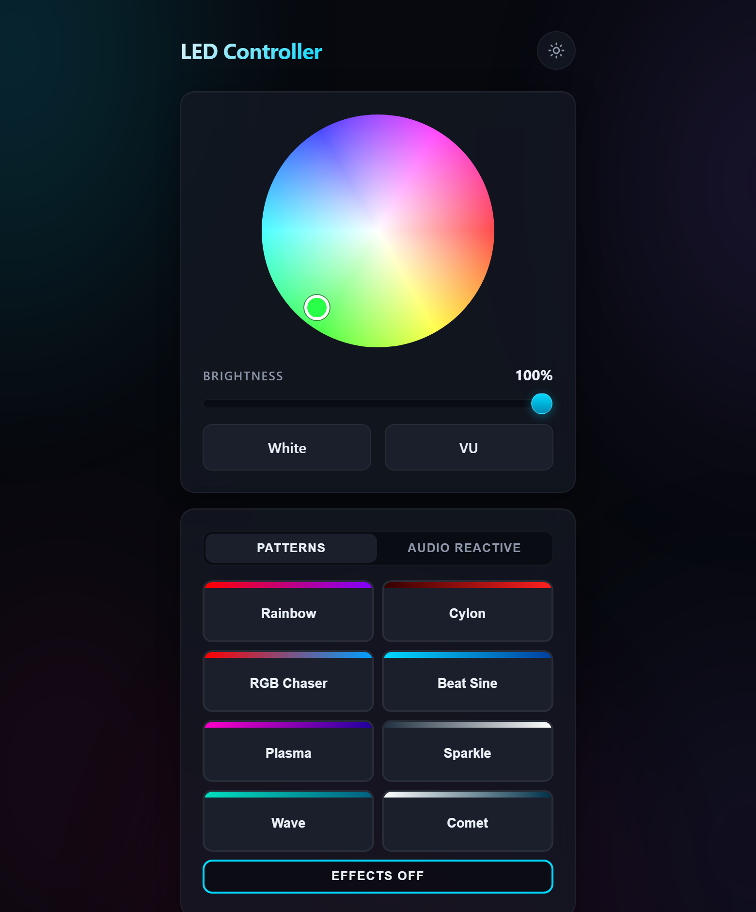 | 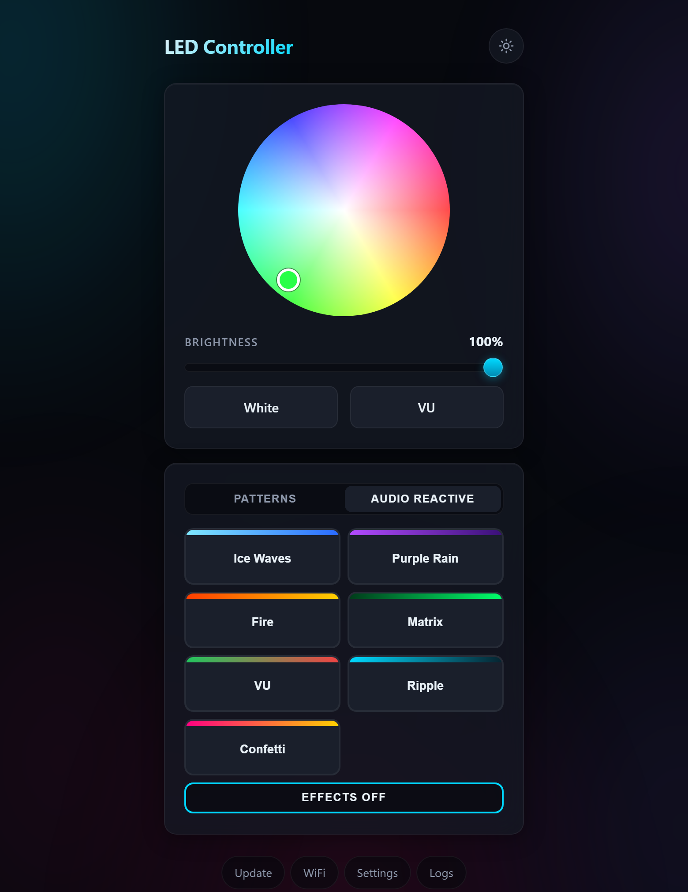 |

**LED Config** holds the strip layout, the screensaver and the Home Assistant settings, plus a
screenshot tool for the panel.

| Screensaver + Home Assistant | LED strips |
|---|---|
| 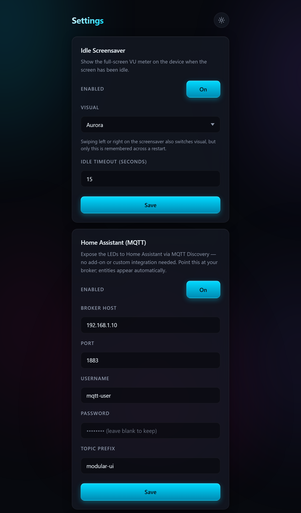 | 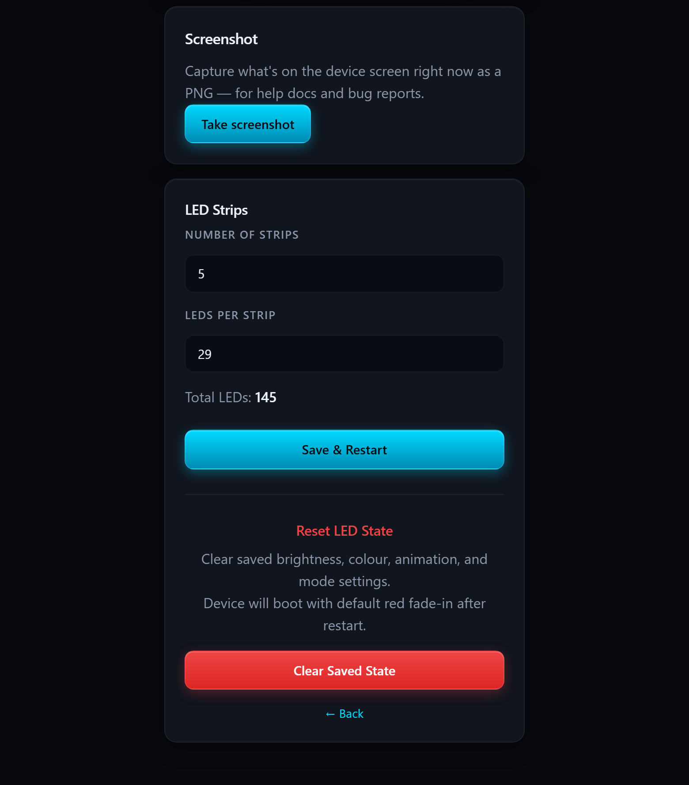 |

`http://rackglow.local/logs` shows the device log — the first place to look when something isn't
working.

## Home Assistant

Rackglow talks to Home Assistant over MQTT and announces itself using MQTT discovery. You need an
MQTT broker; if you don't already run one, use the **Mosquitto broker** app (formerly add-on).

### 1. Install the broker

In Home Assistant go to **Settings → Apps**, install **Mosquitto broker** and start it. Home
Assistant offers to set up the MQTT integration once it's running — accept it.

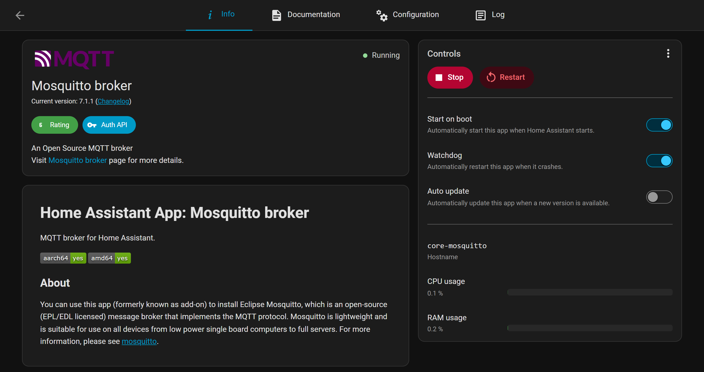

### 2. Create a login for Rackglow

Give Rackglow its own broker login rather than a Home Assistant user. Rackglow stores the password
on the device, and a broker-only login can't be used to sign in to Home Assistant itself.

1. Open the Mosquitto broker's **Configuration** tab.
2. Under **Logins** click **Add**, enter a username (e.g. `rackglow`) and a password, and click
   **Add**.

   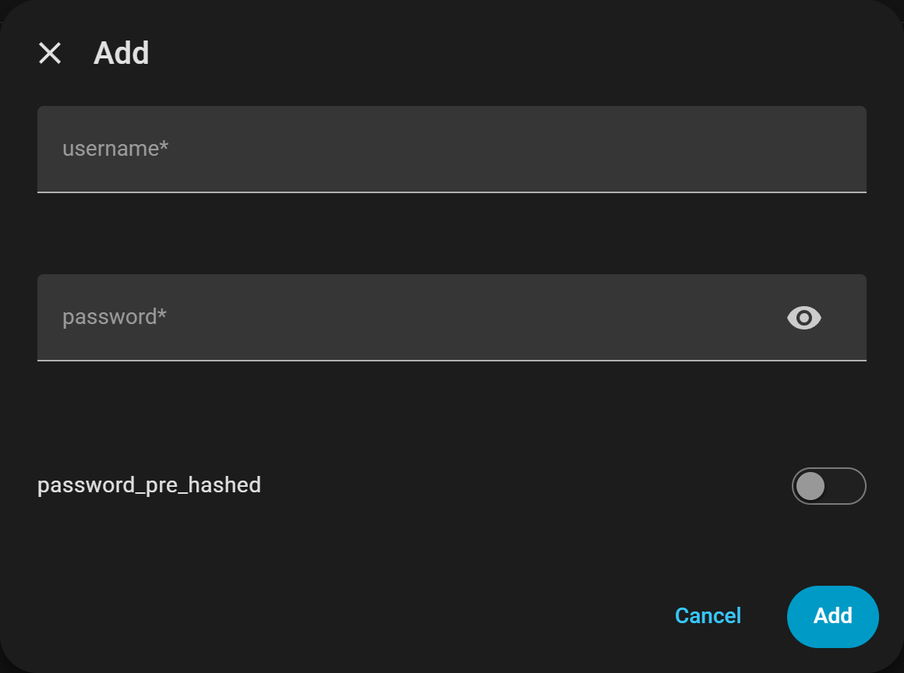

3. Scroll to the bottom of the **Options** card and click its **Save** — it's the button at the end
   of that card, not the one under Network. Accept the offer to restart the broker.

   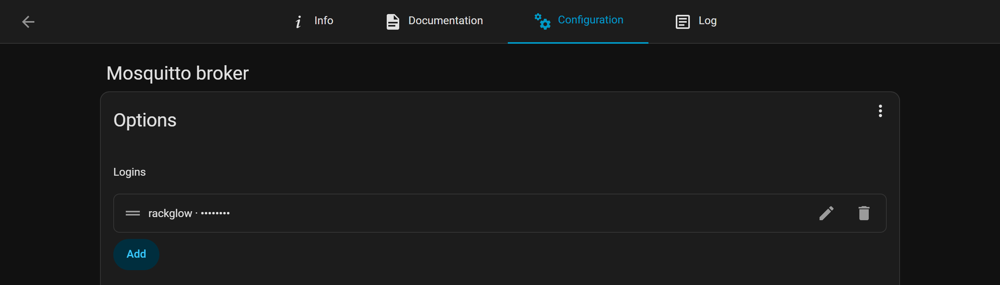

### 3. Connect Rackglow

In Rackglow's web UI open **LED Config → Home Assistant MQTT**, set **Enabled** to On and enter:

| Field | Value |
|---|---|
| Broker Host | Your Home Assistant's IP address (e.g. `192.168.1.20`) |
| Port | `1883` |
| Username / Password | The login from step 2 |

Save. Within a few seconds Rackglow appears under **Settings → Devices & services → MQTT**:

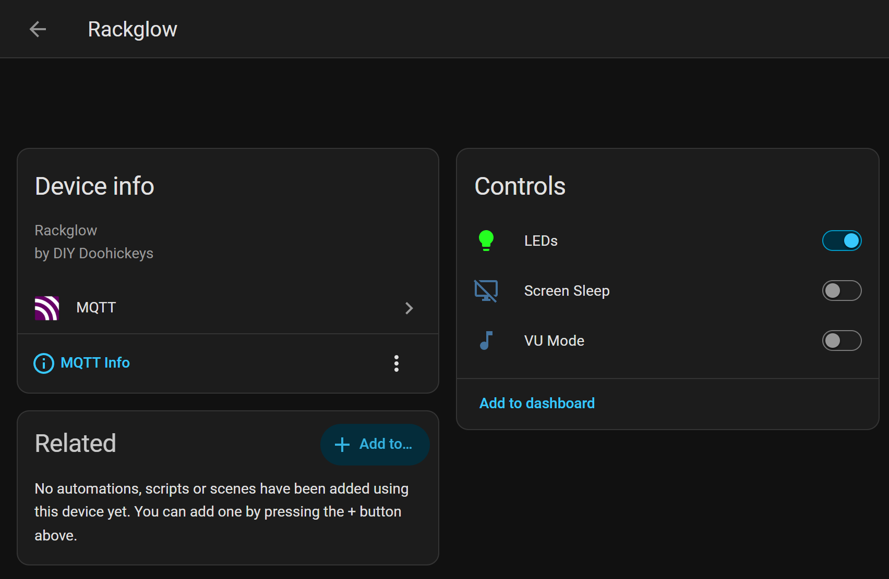

| Colour | Effects |
|---|---|
| 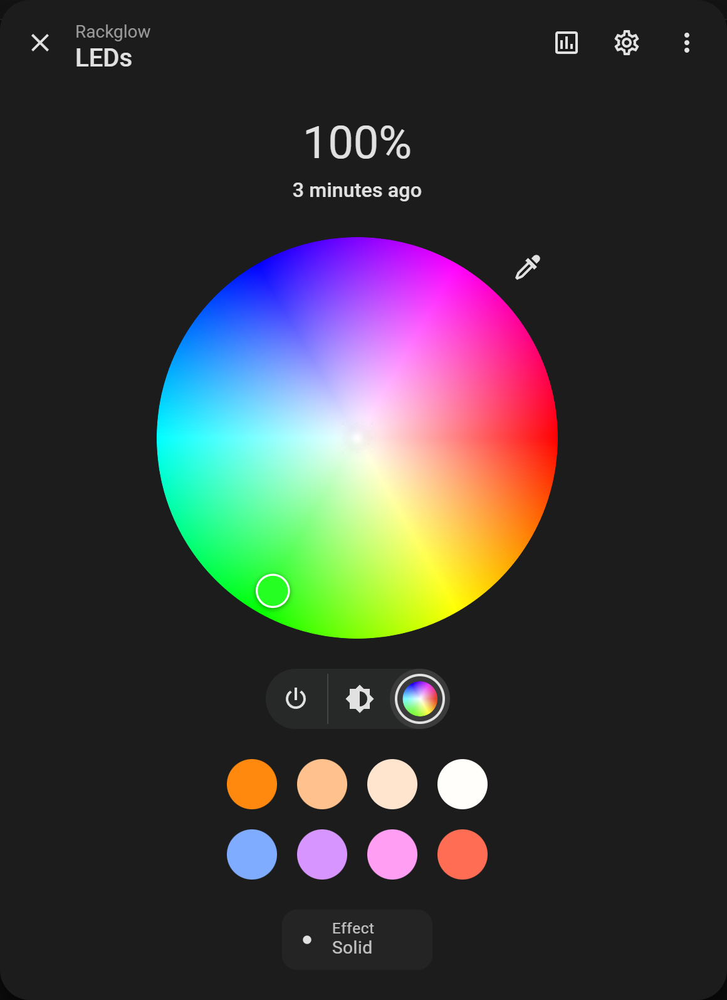 | 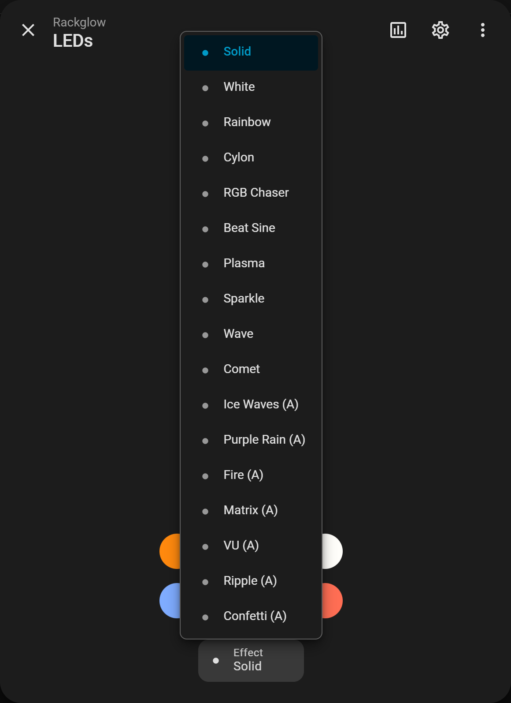 |

| Entity | What it does |
|---|---|
| `light.rackglow_leds` | On/off, brightness, colour, and every effect by name |
| `switch.rackglow_vu_mode` | Brightness follows the audio level |
| `switch.rackglow_screen_sleep` | Screen fully off. Tapping the screen wakes it and turns this back off |

**Not connecting?** `http://rackglow.local/logs` says why: `username or password rejected`,
`cannot reach` (wrong host or port), or a hostname that won't resolve. Use the IP address rather
than `homeassistant.local`.

## Building from source

Built with [PlatformIO](https://platformio.org) on the Arduino framework (the pioarduino platform,
pinned in `platformio.ini`). You also need [Node.js](https://nodejs.org) 20+, because the web UI is
built during the firmware build.

```bash
pio run -t upload
```

- **The web UI is part of the firmware image.** `build_web.py` runs Vite, gzips the bundle and
  compiles it into the binary, so there's no filesystem to upload and a firmware update always
  carries the matching UI.
- **Web UI development:** `cd web_src && ESP32_HOST=192.168.x.x npm run dev` serves the Vue source
  locally and proxies to a running device. Use the IP: Vite can't resolve `rackglow.local`.
- **Partitions:** two 4 MB app slots for OTA, plus NVS for settings. No data partition.

### Pin notes for hardware changes

GPIO 10 is the only ADC1 pin on the Extended IO header. ADC2 (GPIO 11–20) is unreliable while
WiFi is active, which is why the MSGEQ7's analog read on GPIO 12 pauses during an OTA update. A
different analog audio input needs GPIO 10 (moving the LED data elsewhere) or an I2S ADC — retiring
the MSGEQ7 frees GPIO 12, 13 and 21, enough for I2S.

## License

MIT — see [LICENSE](LICENSE). Third-party components and their licences are listed in
[THIRD-PARTY-NOTICES.md](THIRD-PARTY-NOTICES.md).

Made by [DIY Doohickeys](https://diydoohickeys.com).
